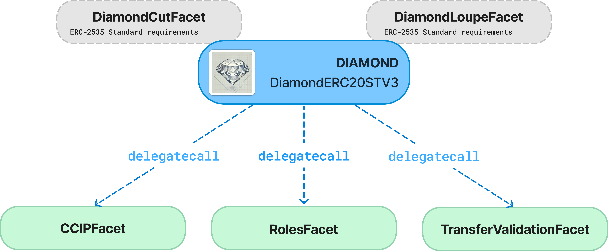

# StoboxProtocolSTV3 

### Deployed Smart Contracts:
### Arbitrum One Mainnet

**[Stobox Token v.3 (STBU)](https://arbiscan.io/address/0x1cb9bd2c6e7f4a7de3778547d46c8d4c22abc093) 0x1cb9bD2c6E7F4A7DE3778547d46C8D4c22abC093**

## Overview
[The Stobox Protocol (STV3)](https://docs.stobox.io/products-and-services/stobox-protocol-stv3) represents the next evolutionary step in blockchain-based compliant infrastructure for RWA tokenization. StoboxProtocolSTV3 is an ERC-20 token implementation using the [Diamond Standard (EIP-2535)](https://eips.ethereum.org/EIPS/eip-2535). It enables modularity and upgradability by separating functionality into different facets. The contract logic is encapsulated within a single contract, which utilizes DELEGATECALL to invoke facet contracts that hold the business logic.

## Features
- **Diamond Standard (EIP-2535):** Enables modular design and contract upgradability.
- **ERC-20 Token Standard:** Supports standard token functionalities of [ERC20 token](https://eips.ethereum.org/EIPS/eip-20).
- **Role-Based Access Control:** Grants specific addresses permission to mint and burn tokens. 
- **Cross-Chain Compatibility with Chainlink's CCIP:** Compatable with [Cross-Chain Token (CCT) standard](https://docs.chain.link/ccip/concepts/cross-chain-tokens).

## Upcoming Features
- **Integration with Stobox DID:** Enables decentralized identity verification for compliant asset transfers. [Learn more](https://github.com/StoboxTechnologies/ST4DIDSC)
- **Validation with Regulatory & Compliance Rules:** Ensures adherence to legal and compliance frameworks within tokenized ecosystems.
- **Integration with Stobox Oracle:** Provides real-time, on-chain data for enhanced asset reliability and compliance.
- **Corporate Treasury Smart Contract Embedment:** Embeds automated treasury management for enterprises leveraging tokenized assets.
- **Security Token Offering Smart Contract Embedment:** Facilitates compliant issuance and management of security tokens.
- **Integration with compliant DeFi:** Enables regulated decentralized finance interactions for tokenized assets.

## Contract Structure




### **1. StoboxProtocolSTV3 (Core Contract)**
Implements ERC-20 token functions.  
Contains immutable functions that cannot be replaced or removed because they are defined directly in the diamond.

- `constructor()`
- `receive()`
- `fallback()`
- `deployer()`
- `owner()`
- `setDeployer()`
- `transferOwnership()`
- `name()`
- `symbol()`
- `decimals()`
- `totalSupply()`
- `balanceOf()`
- `maxSupply()`
- `transfer()`
- `allowance()`
- `approve()`
- `transferFrom()`


### **2. DiamondCutFacet**
Allows the contract owner to add, replace, or remove facets dynamically.

- `diamondCut()`

### **3. DiamondLoupeFacet**
Provides introspection methods to query available facets and function selectors.

- `facets()`
- `facetFunctionSelectors()`
- `facetAddresses()`
- `facetAddress()`
- `supportsInterface()`

### **4. CCTFacet**
Implements the `IERC677` interface for token transfers with additional data.  
Supports minting and burning with role-based permissions.
Manages role-based access control.  
Grants and revokes minting and burning permissions to specific addresses.

- `mint()`
- `burn()`
- `burnFrom()`
- `transferAndCall()`
- `addCCTOperator()`
- `removeCCTOperator()`
- `getCCTOperators()`
- `isCCTOperator()`

### **6. DefaultValidationFacet**
The DefaultValidationFacet is currently a prepared facet for the future implementation of transaction validation logic, allowing the token to meet any compliance requirements.

- `beforeUpdateValidation()`
- `afterUpdateValidation()`

## Repository structure
```
/project-root
│
├── /src
│   ├── /facets
│   │   ├── CCTFacet.sol
│   │   ├── DefaultValidationFacet.sol
│   │   ├── DiamondCutFacet.sol
│   │   └── DiamondLoupeFacet.sol
│   ├── /interfaces
│   │   ├── IBaseERC20.sol
│   │   ├── IDiamond.sol
│   │   ├── IDiamondCut.sol
│   │   ├── IDiamondLoupe.sol
│   │   ├── IERC165.sol
│   │   ├── IERC173.sol
│   │   ├── IERC677.sol
│   │   ├── IERC677Receiver.sol
│   │   └── ITransferValidation.sol
│   ├── /libraries
│   │   ├── LibCCT.sol
│   │   ├── LibDiamond.sol
│   │   └── LibERC20.sol
│   ├── /upgradeinitializer
│   │   └── DiamondInit.sol
│   │
│   └── StoboxProtocolSTV3.sol
│
├── /script
│   └── Deploy.s.sol
│
├── /test
│   ├── BaseDiamondTest.sol
│   └── BaseERC20Test.sol
│
├── .env.example
├── remappings.txt
└── foundry.toml
```

## Setup & Installation

### Prerequisites

Before deploying the contract, make sure you have completed the following:

1. **Wallet**: You need a wallet (e.g., MetaMask) with funds for deployment and transactions.
   - For our example, we will be using the **Arbitrum Sepolia** test network. Ensure that your wallet is set up for this network.

2. **Foundry**: Foundry is the framework used for compiling and deploying the contracts. 
   - If you don't have Foundry installed - follow the [instructions](https://book.getfoundry.sh/getting-started/installation) for your operating system.

## Installation Steps

1. Clone the repository:
```
git clone git@github.com:StoboxTechnologies/Stobox_STV3_Protocol.git
```
2. Install dependencies:
```
forge install
```
3. Set Environment Variables: You need to set up the necessary environment variables in the `.env` file. A sample `.env.example` file is provided in this repository. Fill in the required values for the following variables:
```
   - `ARB_SEPOLIA_RPC_URL`: RPC URL for the Arbitrum Sepolia network.
   - `ARBISCAN_API_KEY`: API key for interacting with the blockchain explorer.
   - `PRIVATE_KEY`: Your private key for the deployer's wallet.
   - `DEPLOYER`: The address of the deployer's wallet.
   - `OWNER`: The address of wallet, which will be the Owner of your token. This wallet will be able to set CCTOperator.
```
4. Compile the contracts:
```
forge build
```
5. Test the contracts:
```
forge test
```
6. Deploy the contract (we use Arbitrum Sepolia):
```
source .env
```
```
forge script --chain 421614 script/Deploy.s.sol:DeployDiamondScript --rpc-url $ARB_SEPOLIA_RPC_URL --broadcast --verify -vvvv
```

## License
This project is licensed under the MIT License.
