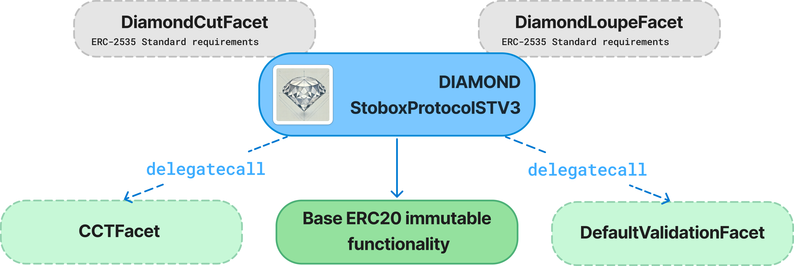

# DiamondERC20STV3 - Smart Contract

## Overview
[The Stobox Protocol (STV3)](https://docs.stobox.io/products-and-services/stobox-protocol-stv3) represents the next evolutionary step in blockchain-based infrastructure for asset tokenization.  
DiamondERC20STV3 is an ERC-20 token implementation using the [Diamond Standard (EIP-2535)](https://eips.ethereum.org/EIPS/eip-2535). It enables modularity and upgradability by separating functionality into different facets.  
The contract logic is encapsulated within a single contract, which utilizes DELEGATECALL to invoke facet contracts that hold the business logic.

## Features
- **Diamond Standard (EIP-2535):** Enables modular design and contract upgradability.
- **ERC-20 Token Standard:** Supports standard token functionalities of [ERC20 token](https://eips.ethereum.org/EIPS/eip-20).
- **Role-Based Access Control:** Grants specific addresses permission to mint and burn tokens. 
- **Cross-Chain Compatibility with Chainlink's CCIP:** Compatable with [Cross-Chain Token (CCT) standard](https://docs.chain.link/ccip/concepts/cross-chain-tokens).  

## Contract Structure




### **1. DiamondERC20STV3 (Core Contract)**
Implements ERC-20 token functions.  
Contains immutable functions that cannot be replaced or removed because they are defined directly in the diamond.

- `constructor()`
- `fallback()`
- `receive()`
- `owner()`
- `name()`
- `symbol()`
- `decimals()`
- `totalSupply()`
- `balanceOf()`
- `maxSupply()`
- `transferOwnership()`
- `transfer()`
- `allowance()`
- `approve()`
- `transferFrom()`


### **2. DiamondCutFacet**
Allows the contract owner to add, replace, or remove facets dynamically.

- `diamondCut()`

### **3. DiamondLoupeFacet**
Provides introspection methods to query available facets and function selectors.

- `facets()`
- `facetFunctionSelectors()`
- `facetAddresses()`
- `facetAddress()`
- `supportsInterface()`

### **4. CCIPFacet**
Implements the `IERC677` interface for token transfers with additional data.  
Supports minting and burning with role-based permissions.

- `burn(uint256 amount)`
- `burn(address account, uint256 amount)`
- `burnFrom()`
- `mint()`
- `transferAndCall()`

### **5. RolesFacet**
Manages role-based access control.  
Grants and revokes minting and burning permissions to specific addresses.

- `grantMintAndBurnRoles()`
- `grantMintRole()`
- `grantBurnRole()`
- `revokeMintRole()`
- `revokeBurnRole()`
- `getMinters()`
- `getBurners()`
- `isMinter()`
- `isBurner()`

### **6. TransferValidationFacet**
The TransferValidationFacet is currently a prepared facet for the future implementation of transaction validation logic, allowing the token to meet any compliance requirements.

- `beforeUpdateValidation()`
- `afterUpdateValidation()`

## Repository structure
```
/project-root
│
├── /src
│   ├── /facets
│   │   ├── CCIPFacet.sol
│   │   ├── DiamondCutFacet.sol
│   │   ├── DiamondLoupeFacet.sol
│   │   ├── RolesFacet.sol
│   │   └── TransferValidationFacet.sol
│   ├── /interfaces
│   │   ├── IBaseERC20.sol
│   │   ├── IDiamond.sol
│   │   ├── IDiamondCut.sol
│   │   ├── IDiamondERC20STV3.sol
│   │   ├── IDiamondLoupe.sol
│   │   ├── IERC165.sol
│   │   ├── IERC173.sol
│   │   ├── IERC677.sol
│   │   ├── IERC677Receiver.sol
│   │   └── ITransferValidation.sol
│   ├── /libraries
│   │   ├── LibDiamond.sol
│   │   ├── LibERC20.sol
│   │   └── LibRoles.sol
│   ├── /upgradeinitializer
│   │   ├── DiamondInit.sol
│   │   └── DiamondMultiInit.sol
│   │
│   └── DiamondERC20STV3.sol
│
├── /script
│
├── /test
│   ├── BaseERC20Test.sol
│
├── remappings.txt
└── foundry.toml
```

## License
This project is licensed under the MIT License.